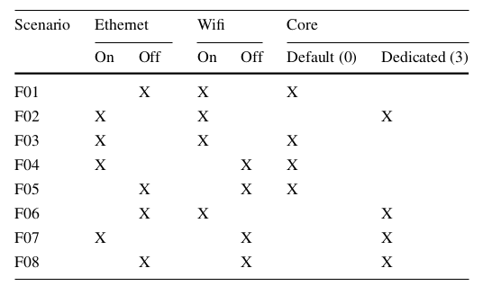

# Execution time measured for EVT experiments

This repository contains the codes and data with execution times of 11 different programs. The samples were collected in a Raspberry Pi environment, under the influence of variations in wifi, ethernet and core affinity. EVT was applied on the measured samples. This experiment was part of the research entitled "Experimental evaluation of the use of extreme value statistics in determining execution time limits for real-time systems projects", master's project by Jamile Vasconcelos, defended in 2023, at the Institute of Computer Science of the Federal University of Bahia, Brazil, under the supervision of Prof. George Lima.

## 1. FILES

### /data
Data measured from all tested programs. 
Tested 11 programs from the Mälardalen WCET Benchmarks [1]: Binary Search, Merge Sort, Quick Sort, Bubble Sort, Sqrt, Cnt, Fibcal, Fft1, Matmult, Insertion Sort

Files in .csv format. 

Random variable: CYCLES, representing the number of clock cycles the program took to run.
 
### /benchmarks 
Source code of the executed programs.

### R_Code.R
Functions used to apply EVT using R.

### maxBlock.R
Function for sampling the maximum values of a numeric vector according to the block maxima approach.

### EVCd.R
Dietrich test functions [5].

## 2. ENVIRONMENT

### Platform
Raspberry Pi 3B [2]

perf_event_open [3] 

### R tools for EVT testing
ExtRemes Package [4]

Dietrich test [5]

### Testing scenarios
08 scenarios (F01, F02, F03, F04, F05, F06, F07, F08)

Collected: 
- 05 samples per scenario/benchmark - 10.000 observations each 
- 02 or 03 extra samples per scenario/benchmark - 100.000 or 500.000 observations each
- PS1: some 1.000.000.000 observations sample are available, but they were not used on the experiment.
- PS2: extra samples were collected for bsort benchmark.

#### Files
Relation between scenarios and the name of the file:
- F01: fibcall_with_wifi_1.csv
- F02: fibcall_with_wifi_eth_core_1.csv
- F03: fibcall_with_wifi_eth_1.csv
- F04: fibcall_with_eth_1.csv
- F05: fibcall_1.csv
- F06: fibcall_with_wifi_core_1.csv
- F07: fibcall_with_eth_core_1.csv
- F08: fibcall_with_core_1.csv

Examples:
When a feature name is in the file name, it means that the feature is turned on. If it is turned off, its name does not appear in the file name. Core ‘0’ was considered “off” and core 3 was considered “on”.

- cnt_with_core_5: cnt - core 3 - sample 05 - 10.000 size
- bsort_with_wifi_eth_3: bubble sort - wifi on - ethernet on - 10.000 size - sample 03 
- matmultt_with_core_100mil_1: matmult - core 3 - 100.000 size - sample 01
- cnt_with_wifi_eth_500thousand_2: cnt - wifi on - ethernet on - 500.000 size - sample 02

- matmult_100thousand_1: matmult - no resources on - 100.000 size - sample 01

### 3. MORE DETAILS 
On [6] and [7]. 

In [8], an appendix can be found starting on page 60, detailing the results of the EVT fitting attempts by sample, benchmark and group (document in Portuguese).

### 4. REFERENCES

[1] Gustafsson J, Betts A, Ermedahl A, Lisper B (2010) The Mälardalen WCET benchmarks: past, present and future. In: 10th international workshop on worst-case execution time analysis (WCET 2010). Schloss Dagstuhl-Leibniz-Zentrum fuer Informatik.

[2] RASPBERRY Pi. s.d. <https://www.raspberrypi.org/>. 

[3] The LINUX man-pages (2022) https://man7.org/linux/man-pages/man2/perf_event_open.2.html, 2021.

[4] EXTREMES. s.d. <https://cran.r-project.org/web/packages/extRemes/extRemes.pdf>.

[5] Dietrich, D.; Haan, L. D.; Husler, J. Testing Extreme Value conditions. Extremes,
Springer Nature BV, v. 5, n. 1, p. 71, 2002.

[6] Vasconcelos, Jamile, George Lima, Marwan Wehaiba El Khazen, Adriana Gogonel, and Liliana Cucu-Grosjean. "On vulnerabilities in EVT-based timing analysis: an experimental investigation on a multi-core architecture." Design Automation for Embedded Systems 28, no. 1 (2024): 1-21. 

[7] de Barros Vasconcelos, Jamile, and George Lima. "Possible risks with EVT-based timing analysis: an experimental study on a multi-core platform." In 2022 XII Brazilian symposium on computing systems engineering (SBESC), pp. 1-8. IEEE, 2022.

[8] Vasconcelos Jamile. Experimental evaluation of the use of extreme values ​​statistics in determining execution time limits for real time system projects: [Master thesis]. Salvador: 2023. Available from: https://repositorio.ufba.br/handle/ri/37443.

